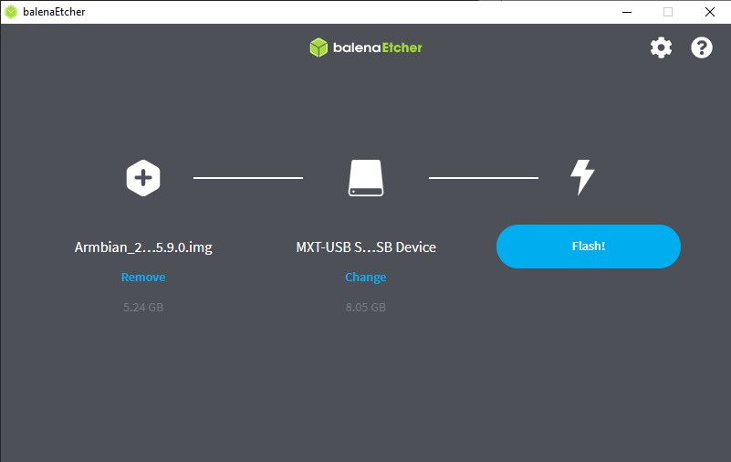
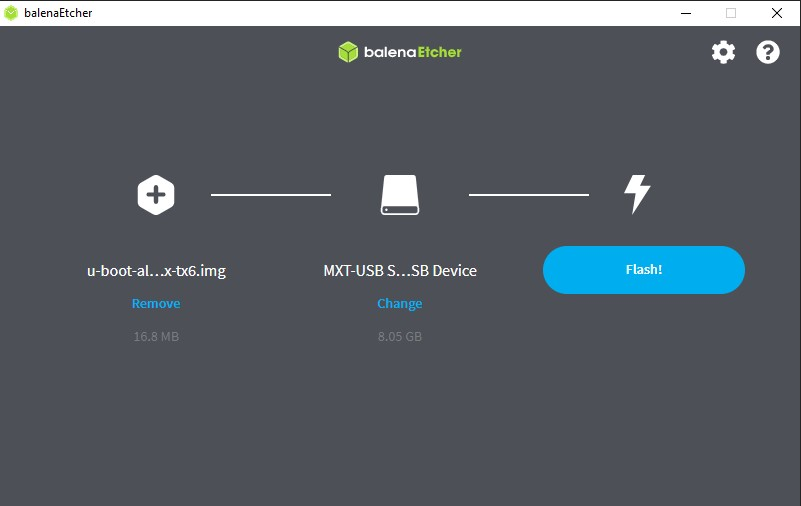

## Installing Armbian in Tanix Tx6 Android Tv Box

#### [Note: There are several types of Tx6 boxes, make sure you are buying Tx6-A which contains Allwinner H6 chip, not Tx6-P or anything else]

#### Downloading Armbian Image

First the boot image was downloaded from the Armbian forum . The link can be found in:

https://disk.yandex.ru/d/_rQgn_FosYuW0g/20.10/20201014

For Tanix Tx6 , bionic_current or buster_current version might be suitable

#### Downloading U-boot 

Then we need to download the U-boot image for our device

https://disk.yandex.ru/d/_rQgn_FosYuW0g/U-BOOT/U-BOOT-ARMBIAN

Find the proper version named Tanix Tx6 


#### Downloading image Burner

We need to downloaded a Image Burner or Writer to write the images to our Sd card or Pendrive
Belena Etcher or Win32 Disk Imager can be used

#### Write Images to the SD card

No we need to burn the images in the Sd card . Fist write the Armbian Image,



eject the SD card, reinsert it and then write the u-boot image in the same drive

[Note: Ignore any kind of error/format dialogs in between]



#### Edit files inside the booted sd card

Now we need to edit some files inside the booted sd card. First we have to eject the 
SD card and Reinsert it.
Then find the uEnv.conf file inside the Sd card, comment out the configuration made for
rk-3399 by putting '#' in their front.

```
#FDT /dtb/rockchip/rk3399-roc-pc-mezzanine.dtb
#APPEND root=LABEL=ROOTFS rootflags=data=writeback rw console=uart8250,mmio32,0xff1a0000 console=tty0
no_console_suspend consoleblank=0 fsck.fix=yes fsck.repair=yes net.ifnames=0
```

After that we have to figure out the aw h6 lines and comment out the FDT and Append lines
removing # from their front

```
FDT /dtb/amlogic/meson-gxl-s905w-p281.dtb
APPEND root=LABEL=ROOTFS rootflags=data=writeback rw console=ttyAML0,115200n8 console=tty0 no_console_suspend
 consoleblank=0 fsck.fix=yes fsck.repair=yes net.ifnames=0
```

Now we have to rename some files.
1) Rename the following files, adding .orig to the filename  

Rename boot.cmd to boot.cmd.orig<br/>
Rename boot.scr to boot.scr.orig<br/>
Rename boot-emmc.cmd to boot-emmc.cmd.orig<br/>
Rename boot-emmc.scr to boot-emmc.scr.orig<br/>

2) Rename the following .aw files, removing the .aw extension<br/>
Rename boot.cmd.aw to boot.cmd<br/>
Rename boot.scr.aw to boot.scr<br/>
Rename boot-emmc.cmd.aw to boot-emmc.cmd<br/>
Rename boot-emmc.scr.aw to boot-emmc.scr<br/>

Now we are ready to go, eject the SD card and insert it into the Tanix Tx6 and power it on.

It will automatically lead us to the boot menu.

After a while it will ask for name and password. We have to insert boot and 1234 and then set our
own usename and password.

We are good to go.


